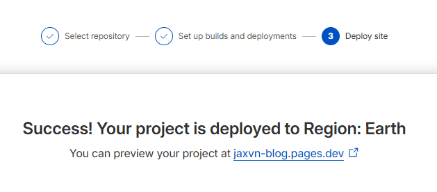

# Deploy Site Lên Cloudflare Pages (Public Live – Optional)

Sau khi hoàn thành Tutorial Basics và Tutorial Extras, bạn có thể deploy site lên Cloudflare để live public (miễn phí, auto-update khi push GitHub).

## Các Bước Deploy
1. Cloudflare Dashboard > **Pages** > **Create a project** > **Connect to Git** > Chọn GitHub > Authorize > Chọn repo `jaxvn-blog`.
2. Project name: `jaxvn-blog` > Branch: `main` > Framework: None.
3. Build settings: 
   - Command: `npm ci && npm run build` (switch npm cho CI ổn định; tạo package-lock.json local bằng `rm yarn.lock && npm install` nếu cần).
   - Output dir: `build`.
   - Root dir: `blog` (vì site anh ở folder `blog/`).
4. Save and Deploy – chờ 1-2 phút > Visit `https://jaxvn-blog.pages.dev/docs/intro`.

- **Auto-update**: Mỗi push GitHub = rebuild tự động.
- **Preview PR**: Tạo branch mới > Push > Cloudflare auto tạo subdomain test (e.g., branch-name--jaxvn-blog.pages.dev).

Quay lại [Intro](/docs/intro) nếu cần!